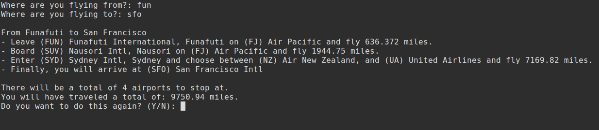

# Shortest Airline Route
Finds shortest path between any two airports in the world, implemented using Dijkstra's algorithm.

# Screenshot

# License
This project is released under MIT License. Please review the [License file](LICENSE) for more details.
